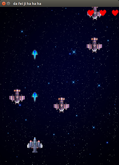
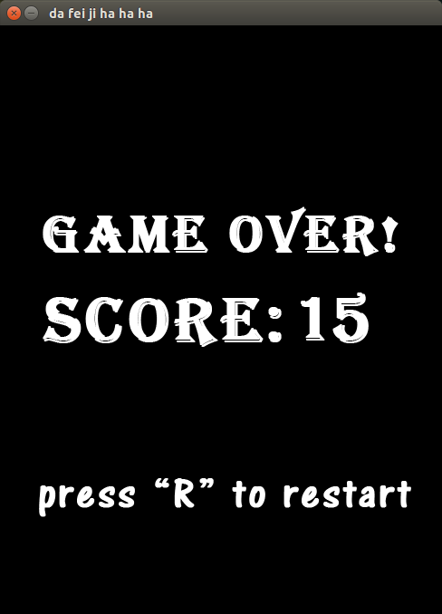
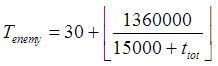
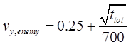

#期末作业——利用pygame制作“逼死强迫症飞机大战”小游戏

##摘要

利用pygame实现了飞机大战游戏的制作。该游戏是通过用户的键盘命令来控制一架移动
速度很慢的飞机前后左右移动来攻击不断飞来的敌人并取以得高分为目的的射击游戏。游戏中使用pygame提供的pygame.event
.get()来监测用户的操作，通过一个主循环不断刷新显示页面来产生动态效果。  

===

##简介

这是一款飞机射击游戏。游戏中，玩家通过上下左右键位来控制飞机移动。飞机以固定频率自动发射直线飞行的子弹，如果子弹击中敌方飞机，敌机和子弹都会消失，玩家获得一分。敌机从屏幕上方不断出现，以一定的速度向下移动，同时也会以随机的速度左右晃动来增加击中的难度。游戏界面如下图。



敌机在左右晃动的时候可能会移出屏幕侧边，而玩家操作的飞机只能在屏幕可见的范围移动，这时是不可能击中敌机的，这进一步增加了游戏难度。不过在设计敌机的移动逻辑时，我保证了在其移动到屏幕底线之前的时间内一半以上时间都是视野内可见的，并且其运动轨迹和从屏幕外再次进入视野的时间是可以预判的，这样也保证了玩家不会有无论如何都消灭不掉的敌机。

玩家共有三和生命点，每有一架敌机到达屏幕底端便会损失一点生命，三点全部消耗完游戏便结束了。游戏中每消灭一架敌机便会获得一分，游戏结束后显示玩家获得的总分，然后玩家可以按“R”键重新开始。游戏结束界面见下图。



玩家操纵的飞机的飞行速度很慢，这令玩家必须很好地规划移动方向和顺序才能生存得更久。玩家控制的移动速度在不同电脑上可能会有所差别，因为我没有在别的电脑上尝试过，所以不是很确定，但因为飞机移动不是有一个固定速度通过计时器来计算移动距离，而是在每次循环中移动固定距离，只是通过计时器限制了帧频，所以在很卡的电脑上飞机移动会更慢。然而子弹和敌机的移动都是用速度乘时间的方式来得到，因此不论帧频是多少都不会变，因此在很卡的电脑上说不定这个游戏会更难。


---

##程序思路

- 1	首先导入必要的模块：pygame和random等必要的模块。


- 2	导入游戏中需要用到的图片和音频资源，将图片导入surface对象。

- 3	建立游戏窗口，由于我选的背景图的分辨率是488*650，因此窗口分辨率与之统一。

- 4	定义一个计时器。

- 5	进入最外层大循环，初始化分数、生命、计时等各种变量。其中有子弹列表bullets，敌机列表enemies等为空列表。

- 6	进入游戏主循环。

- 7	主循环首先做是否死亡的判断，如果死亡则显示游戏结束画面，用户按“R”键，则退出主循环，进入外层循环，重新初始化变量，进入主循环。

- 8	当用户没有死亡时，主循环执行游戏界面：
  > - 8.1	检测用户操作，如果有按键操作则相应地改变飞机位置的移动量
  > - 8.2	记录本次与上次循环之间的时间差  
  > - 8.3	对子弹列表中每一个子弹循环，所有子弹都前进   个像素点；如果一颗子弹超出屏幕之外，则从列表中删除。
  > - 8.4	设置一个计时量对每次的 进行累加，如果超过发射时间间隔，则发射一颗子弹：  
      ```
      bullets.append([x+16,y-32])   
      ```
      - 同时播放发射子弹音效，并使计时归零。
  > - 8.5	对敌机列表中每一架敌机循环，如果有子弹的位置与它发生碰撞，则将子弹与敌机都从列表中删除，播放击中敌机音效，并且给score加一分。
  > - 8.6	对敌机列表中每一架敌机循环，以总计时（这个是只在一局新游戏开始时归零，之后一直累加的总时间）为时间标准，800ms为周期做横向周期摇摆，摇摆的速度是每架敌机各不相同的随机值，同时以固定速度向前移动：  
      ```
      for ene in enemies:  
          if ttot%800>400:  
              i=-1  
          else:  
              i=1  
          ene[0]+= dtime*i*ene[2]  
              ene[1]+= dtime*v_t   
      ```
      
  > - 8.7	如果一架敌机到达屏幕底线，删除这架敌机，生命减少1，如果生命降为0，则判断为死亡，下次主循环进入游戏结束画面：    
      ```
      if ene[1]>630:  
          lives-=1  
          enemies.remove(ene)  
          if lives == 0:  
                  dead=True  
      ```
      
  > - 8.8	敌机出现周期是总时间的函数，随着总时间增加，敌机出现越来越快，越来越多：    
      ```
      a_t=(30+1360000//(15000+ttot))  
      if ttot%a_t+dtime>a_t:  
          enemies.append([random.randint(20,404),25,random.randint(-100,100)/100.0])  
      ```
      
  > - 8.9	清屏，绘制屏幕上的背景，飞机，子弹，敌机，生命数标志。

##一些细节的实现

>###图片化的数字的使用以及显示
> - 首先，将0~9的数字放在一张图片上，使用subsurface功能可以截取一个surface对象的一部分。但是莫名其妙地出了bug。报错提示矩形区域超出surface的范围，但是明明没超出，况且把范围增大了很多反而不报错了。上网查了也没能找到问题的原因。
> - 这个不过始终未能得到解决，无奈只好把图片裁剪成一个一个的数字：  
    ```
    for num in '1234567890':  
        numbers[num] = pygame.image.load('number'+num+'.png')
    ```
    
> - 显示时用循环的方法，每次使显示位置右移。
> - 前面说的出了bug的代码没有删，注释起来了，如果老师有空能帮我看一下告诉我是什么原因将非常感谢。
>###连续跳出两层循环
> - 在游戏结束页面按“R”是需要退回最外层大循环，但是在此之间隔了两层循环，于是如何break出两层就是一个很麻烦的问题。
> - 我之前尝试了用函数互相引用的方式，但是也不幸的出了奇怪的bug，所以放弃了。Python里面没有标记转到某行这样的语法，也没有跳出多层的命令，无奈之下去请教了大神刘文焘同学（2003301020085），他一句话就令人恍然大悟。解决方法很简单：  
    ```
    while True:
        if lives == 5:
            break
        if dead:  
            for event in pygame.event.get():
                if event.type == QUIT:
                    exit()
                if event.type == KEYDOWN:
                    if event.key == K_r:
                        lives = 5
                        break
    ```
  
> -  
>###敌机逐渐变强
> - 敌机出现频率升高：
    - 经过一些计算和测试，决定使敌机出现的大致频率（由于算法的特殊性，敌机并不是完全周期出现的，可能忽多忽少，忽密忽疏，这两句代码前面已经贴了。所以只能说是大致的周期，或者是表征相邻两个敌机出现时间间隔的特征时间）为：
    - 随总时间变短，但不会短于30ms  
    

> - 敌机速度增加
    - 敌机在纵向移动的速度也会增加，公式如下（单位：像素/ms）：  
    
      

##总结

在网上看到pygame的教程，正好我对写游戏比较感兴趣，所以就学习并写了这个简单的小游戏。本来可以更完善的，但是时间不够了，而且期末比较紧张。

程序完全是自己写的，甚至用的素材图片大部分都是我自己P的，debug也花了不少工夫。虽说游戏本身有点low，但是希望老师看在认真的份上给个pass吧。多谢老师～


